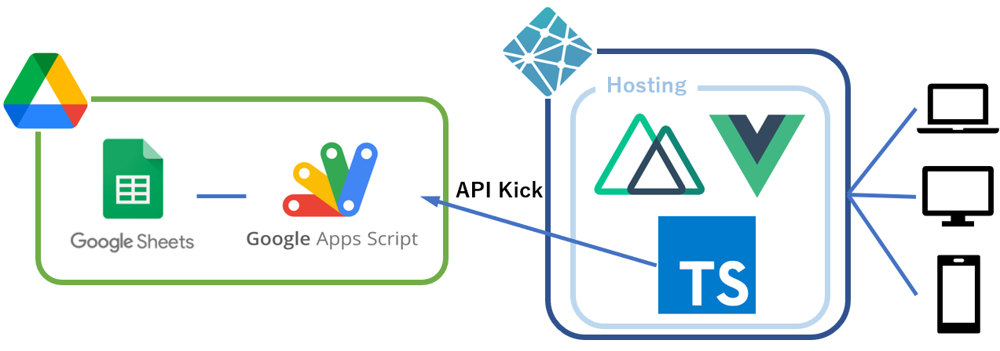

あるサイト作成に関わっているんですが、iOSからのみネットワークエラーが発生するというバグが発生しました。

サイト構成はスプレッドシートで集計した情報をAPIで出力し、NetlifyにホスティングしたWebアプリケーションからキックして描画って感じです。



Androidのスマホや、WindowsのPCなどではAPIを叩けるんですが、iPhoneやMacbookなどではAPIKickに失敗するという減少が起きました。

# 何が起きているのか

Macbookでログを確認したところこんな感じ


```
xmlhttprequest cannot load ~~~ due to access control checks
```

っていうエラー文言が出てきたので、ググってみるとどうやらCORSらしい。  
なので、まずCORS対応をやってみました。

# CORS対応してみる

参考にしたサイトはここらへん

<iframe 
  class="hatenablogcard" 
  style="width:100%;height:155px;max-width:680px;" 
  src="https://hatenablog-parts.com/embed?url=https://qiita.com/Kazuki-Komori/items/9441fe22181bd89a29df"
  width="300" height="150" frameborder="0" scrolling="no">
</iframe>

<iframe 
  class="hatenablogcard" 
  style="width:100%;height:155px;max-width:680px;"
  src="https://hatenablog-parts.com/embed?url=https://kawadev.net/vuejs-gas/" 
  width="300" height="150" frameborder="0" scrolling="no">
</iframe>

どうやらリクエストパラメータに
```
crossDomain: true
```
を入れると解消されるらしい。

おっしゃ！楽勝やで！と思ってやってみるも解消されず。なんで…

# Preflight responseとかいうやつが悪いのか

ログを見返してみると
```
Preflight response is not successfull.
```
という記述があったので、CORSじゃなくてもしかしてこれか？？と思って調べてみました。

どうやら、リクエストには**Simple Request**と**Preflight Request**というものがあるらしく、**Preflight Request**だと通常のリクエストの前に、接続ができるか確認する前にOPTIONリクエストを送信して確かめるらしい。

参考は以下
<iframe 
  class="hatenablogcard" 
  style="width:100%;height:155px;max-width:680px;"
  src="https://hatenablog-parts.com/embed?url=https://tech.actindi.net/2019/11/12/100202"
  width="300" height="150" frameborder="0" scrolling="no">
</iframe>

<iframe 
  class="hatenablogcard" 
  style="width:100%;height:155px;max-width:680px;"
  src="https://hatenablog-parts.com/embed?url=https://qiita.com/nnishimura/items/1f156f05b26a5bce3672"
  width="300" height="150" frameborder="0" scrolling="no">
</iframe>

で、1つ目の記事の通り、Simple Requestにするには以下の条件を満たさなければいけないらしい。
- リクエストは GET, POST, HEAD メソッドのいずれか
- 次のリクエストヘッダ以外をセットしていない
  - Accept
  - Accept-Language
  - Content-Language
  - Content-Type
- Content-Type が次のいずれか
  - application/x-www-form-urlencoded
  - multipart/form-data
  - text/plain

やってみるか、と思いリクエストヘッダを色々いじってみるが、2番目の条件である**「次のリクエストヘッダ以外をセットしていない」**がGASのAPIをキックする場合はどうもクリアできず、こちらも撃沈。

すでにこのときには心が折れているワイ。寝て、別日に作業することにしました。

# Netlify Functionsを使う

もうなんだか分からんので、とにかく直接GASのAPIを叩かせるのはやめようということで、Netlify Functionsを使うことにしました。

Netlify FunctionsはFaaS(Function as a Service)で、AWSをよく使う方はLambda、GCPをよく使う方はCloud Functionsを想像していただければよいかと思います。

参考資料はこちら
<iframe 
  class="hatenablogcard" 
  style="width:100%;height:155px;max-width:680px;"
  src="https://hatenablog-parts.com/embed?url=https://qiita.com/Sr_Bangs/items/7867853f5e71bd4ada56"
  width="300" height="150" frameborder="0" scrolling="no">
</iframe>

NetlifyのアカウントにGithubが紐付いている方であればすぐに利用できるかと思います。

要は構成をこういう感じに変更することにしました。


で、実際に書いたコードがこちら(一部修正してます)

```javascript
const axios = require('axios');

exports.handler = async (event) => {
  const { keyword } = event.queryStringParameters;

  const URL = `${process.env.GAS_API_URL}/exec?keyword=${encodeURI(keyword)}`;
  return axios.get(URL)
  .then(({ data: data }) => ({
    statusCode: 200,
    headers: {
      'Content-Type' : 'application/json;charset=utf-8',
      'Access-Control-Allow-Origin' : '*',
    },
    body: JSON.stringify(data)
  }))
  .catch(e => ({
    statusCode: 400,
    body: e
  }));
};
```

こちらキーワードによる検索機能のAPIですが、ポイントは3点あります。

## リクエストパラメータの取り出し方
```
event.queryStringParameters
```
で取り出せます。

**hoge**っていうパラメータであれば
```
event.queryStringParameters.hoge
```
でいけます。

## QueryStringに乗せるときにはURIエンコードしよう
6行目でURLを作ってますが、その際にURIエンコードしております。

Netlify Functionsを叩いたパラメータをそのままURLに渡せばいけるかと思いきや、URIエンコードしないとクライアントエラーを吐きました。これで1時間半ぐらいもってかれました。くやしい。

## Netlify FunctionsにもCORS対応
勿論Netlify FunctionsでもCORSは対応しましょう。

でもGASとは違ってレスポンスヘッダを設定できるので楽ですね。
上記コードの11,12行目ですね。
<br><br><br><br>
これでGASを直接叩いていた箇所を、Netlify Functionsに向き先変更してやってみたところKick成功！
長い戦いであった…

# 結局なんだったのか
以前は全くそんなこと起こってなかった**iOS端末からのみGASのAPIが叩けなくなる**というこの事象。

詳しいことはよく分かってないのですが、どうやら最近のiOSのアップデートに問題がありそうな…？？

ここらへん詳しい方、是非教えてくだされm(_ _)m