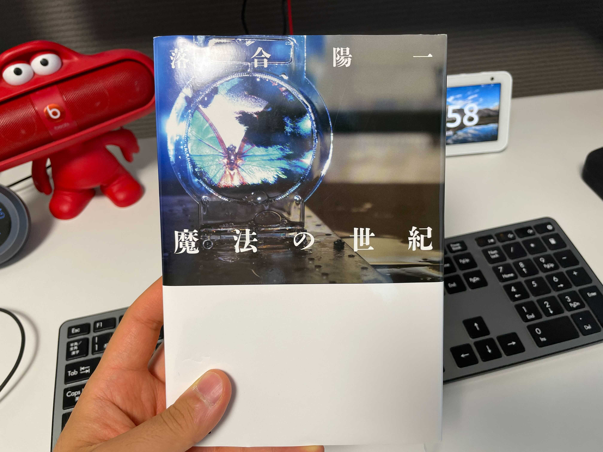

NewsPicksのWeekly Ochiaiが好きで、ちょいちょい見ていて、「落合さんの本ちょっと読んでみようかな～」と思って色々調べてたんですよ。

<iframe 
  class="hatenablogcard" 
  style="width:100%;height:155px;max-width:680px;"
  src="https://hatenablog-parts.com/embed?url=https://newspicks.com/movie-series/28/" 
  width="300" height="150" frameborder="0" scrolling="no">
</iframe>

いつだったかのWeekly Ochiaiで、**「落合さんは『読者は全員魔法の世紀を読んでいる』という前提で本書いてますよね？笑」**みたいなツッコミをされていたので、じゃあ魔法の世紀から読んでみるか、ということになりました。

Weekly Ochiaiが好きとは言っても、5割は勉強、3割は落合さんのわけわからん話をスゲ～～と思って聞く、2割は落合さんの意見に圧倒されるゲストというフリースタイルダンジョン感という楽しみ方をしているので、本も買ってはみたものの、中身訳わからなかったら嫌だな～～とは思ってました。

しかし、いざ読んでみると、意外とそんなこともなく。  
勿論物理の話とか、西洋の歴史とかで分からんところは多々出てくるんですが、普段の日常生活で扱うようなネタを例で出してくれたりと。随所に読みやすくなるような工夫がされていて、「確かに落合さんの本で最初に読むのには割と良い難易度かもしれんな」と思った次第です（他読んだことないけど）。

実はこの記事自体も読みながら書き進めているので、多分次々と文量が増えます笑  
そこも是非お楽しみください笑

では、中身の簡単な要約と感想をつらつらと書いていきます。

# そもそも「魔法の世紀」とは
20世紀が「映像の世紀」だったことに対する対比表現ですね。

19世紀末にエジソンがキネトスコープを発明したことをきっかけに、写真や絵などある一瞬を収めるメディアの方向とは異なり、連続的な時間変化も含めて「映像」という形で保存が効くようになります。

この映像は皆さん御存知の通り、情報量が非常に大きく、20世紀に行われたオリンピックなどの盛り上がりの裏では、映像が視聴者に与えることのできる情報量と、ある一瞬しか捉えることのできない写真や絵などでは伝わらない熱量が、あのオリンピックの盛り上がりを支えていたといっても過言ではないことでしょう。

そんな切り口により20世紀は「映像の世紀」だったというのに対し、本書では21世紀は「魔法の世紀」だと言っています。

では、「魔法」とは何か。**コンピュータ**ですね。

科学などが発達する以前では、人間の知識が及ばない領域は、「魔術」「迷信」で理由付けられてきました。  
本書では、一例として「昔の人が食材を火で炙るのは『炎が穢れを浄化する』と思われていたからだ」と記載されています。

それは科学現象の理由をよく知らなくても、人間がつけた理由により日常生活において科学が使えてきたことを意味します。

この非科学的な説明が、現代の科学の進化によって覆されていることは言うまでもありません。

しかし、現代におけるコンピュータはこの「魔術」的存在になっているのではないかというのが本書の最初の主張であり、「魔法の世紀」を理解する上での前提となる考え方です。

現在のコンピュータは、キーボード、マウス、ディスプレイなど、かなり人間に優しいインターフェースが採用されています。

それ故、我々はコンピュータの中で何が行われているのかをさほど意識することなく、コンピュータの恩恵を享受する事ができます。

そんなコンピュータは、今や非現実の世界のみならず、飲食、小売、建築などなど、様々な業界に応用され、現実のものにも影響を与えています。  
そこで使われているコンピュータも同じくして、ユーザーからすれば、中身で何をしているのかは分からないものです。

これはまさしく、昔に説明ができなかった科学と同じではなかろうかと。  

このように全員が現代の「魔法」を使えるようになった時代、それが「魔法の世紀」であるというのが、序盤のざっくりとした要約です。

# 本の構成
本書はそんな「魔法の世紀」の核であるコンピュータと、その他の要素についての掛け合わせについて、各章で書かれています。

第1章ではコンピュータの歴史について

第2章では「心を動かすコンピュータ」というタイトルで、**コンピュータ×アート**について

第3章では「イシュードリブンの時代」というタイトルで、**コンピュータ×課題解決**について

第4章では「新しい表層/深層」というタイトルで、**コンピュータ×デザイン**について

第5章では「コンピューテショナル・フィールド」というタイトルで、**コンピュータ×メディア**について

第6章では「デジタルネイチャー」というタイトルで、**コンピュータ×自然**について書かれています。

ここからは個人的に面白いとおもったところを書いていこうと思います。

# 要約＆感想

## パソコンの思想 vs 人工知能+プラットフォームの思想

コンピュータがどのようにして人間の生活を良くするのかという方向性の話です。

パソコンと人工知能、プラットフォームという話をすると、後者の方が先進的なイメージを受けますが、そもそもの考え方が違います。

前者のパソコンは**人間の能力を拡張しよう**という考え方です。  
コンピュータはあくまで人間が使うものであり、人間の知能だったり、身体能力だったりを最大限拡張・拡大することがコンピュータを利用する意義であるということかと思います。

後者の人工知能+プラットフォームというのは、**人間の代わりに活動してくれたり、逆に人間がテクノロジーの上で活動したりする**という考え方です。  
人間の手の届かないところであったり、最終的には人間が知らないところで活動が起こるという思想でしょうか。

本書の例では、「パソコンの思想」派でApple（ジョブズが亡くなってからは方向性が変わったとも書かれていますが）、「人工知能+プラットフォームの思想」派でGoogleが紹介されています。

私自身、技術畑の人間なのですが、この2つの位置関係として、人間の能力の拡張の上位互換が人工知能ではないかと考えているところもありました。

しかし、技術の生い立ち自体を考えると人間の能力が拡張され続け、その拡張された能力が保管しあってプラットフォームのようになるのが良いのかなぁと思ったり。  
すごくオープンソースに似通った考えですかね。

何より、働くチームであったりとか、会社であったりとか、組織においてここの考えを共有し、共通認識を持つことが重要なのかなぁと思いました。

答えは無いであろう議論ですが、ここのテクノロジーに対する向き合い方が、組織の末端まで統一されていないと、作ったプロダクトのUXが統一されないんじゃないかと思います。

例えば最近触ったプロダクトでいうと、オンラインホワイトボードツールのmiroですね。

<iframe 
  class="hatenablogcard" 
  style="width:100%;height:155px;max-width:680px;"
  src="https://hatenablog-parts.com/embed?url=https://miro.com/index/" 
  width="300" height="150" frameborder="0" scrolling="no">
</iframe>

ブラウザで動くWebアプリで、オンライン上でホワイトボードを作成し、絵を書いたり、付箋を貼ったりできます。

これは明らかに人間の能力を拡張しようという考えで作っているツールかと思います。

勿論物理のホワイトボードでの議論をオンライン環境に移すことで場所から開放されますし、際限なくホワイトボードを広げることができるため、ホワイトボードの面積という概念からも開放されます。  
それでいて、現実世界のペンや付箋はオンライン上で自由に使うことができます。  
非常に分かりやすいUIで、特に説明をしなくてもサッと使えたツールです。

ホワイトボードという分かりやすいイメージがあるため、開発の際にイメージのすり合わせがしやすかったのかなと思います。  

こういった使いやすいプロダクト開発のためにも、普段からこういったテクノロジーに対する広い認識の話をしておくべきだなぁと思いました。

## イシュードリブン

<iframe 
  class="hatenablogcard" 
  style="width:100%;height:155px;max-width:680px;"
  src="https://hatenablog-parts.com/embed?url=https://www.amazon.co.jp/dp/4862760856/" 
  width="300" height="150" frameborder="0" scrolling="no">
</iframe>

イシューからはじめよという有名な本もありますが、本書ではイシュードリブンをアート×テクノロジーという側面から語り始めます。

現代のアートは、歴史の教科書の風刺画とは異なり、実際に社会課題の解決を目指す行動に直結することもあります。

Black lives matterの運動などはいい例ですね。

<iframe 
  class="hatenablogcard" 
  style="width:100%;height:155px;max-width:680px;"
  src="https://hatenablog-parts.com/embed?url=https://www.bbc.com/japanese/video-53358659" 
  width="300" height="150" frameborder="0" scrolling="no">
</iframe>

現代では、人間がテクノロジーによって能力が拡張され、多くのタスクが同時にこなせるようになったことで、アーティストが作品を生み出すだけでは物足りなくなり、その作品に社会的な意義をもたせようとしたのがこの流れのきっかけではなかろうかと考察されています。

社会的な意義を見つけるためには、既存の課題に大して活動するだけではなく、自分で課題を見つけてそれに取り組む、まさしくイシュードリブンが必要になる、という話です。

本書ではアートについて書かれていますが、より一般的に書いてみると、  
**自分の作品や仕事ができることだけでは物足りなくなり、そこに社会的な意義をもたせようとし始める。  
社会的な意義を見つけるためには、まず自分で課題を見つけなければならない。**

自分の仕事では物足りなくなったものの、そこで意気消沈するパターンもあるわけですし、自分のモチベーションを保ち続けるための1つのスキルとしてもイシュードリブンを大事にしていこうと強く思いました。

## 工学とデザインの乖離と再結合

今でこそ、工学とデザインは別のものとされ、組織によっては別の人が担当したりしますが、以前はこうではありませんでした。

例えば家具を例に話をしましょう。

産業革命が起こる前は、職人のような人が手作業で一つ一つ作っていました。  
勿論材料の確保から、材料の成形、結合、色塗りまですべて一人です。この時には工学とデザインが一緒のものであることは言うまでもありません。

しかし、産業革命により、機械がものづくりを代わりに行うようになりました。

すると、**製品の機能などを決める専門職**が出てくるようになり、これがデザイナーの始まりではないかと本書では書かれています。  
さらにデザインは「ブランド」によって、デザインそのものの価値と、ブランドによって高められた価値が剥離していきます。

では工学はどうでしょうか。  
工学は**「特許」の誕生により、作る技術そのものが価値を持つようになりました。**

このように、最初は線引などなかった工学とデザインが、時代の流れを経るにあたって徐々に乖離してきたという歴史があります。

しかし、現代の工学は、まさしくこれの逆を辿ろうとしています。

ソフトウェアは分かりやすい例ですが、ソフトウェアは機械のラインなどで作る必要がなく、1人のエンジニアが作り上げたソフトウェアはコピーする形で大量生産が可能になります。  
また、冒頭の魔法の世紀の要約のように、ソフトウェアが今や現実世界にまで染み出し、CADなどを使えば物理的なオブジェクトまでソフトウェア上で作成することができるようになりました。

このように現在のものづくりのシーンにおいては、昔の職人のような工学とデザインの一体化が再び起こっているわけです。

現在デザインを専門としている人や会社は多々あると思います。  
勿論素晴らしい仕事ですが、良いプロダクトを作るために、それぞれの関わるべきスコープというものを考え直してみては如何でしょうか？

# まとめ
これ書いているときは全部読み切ってるわけじゃないので、何か他に面白かったところがあり次第、随時追加していこうかなと思います。

私は職業上エンジニアとしての側面がかなり強い感想でしたが、他のバックグラウンドの人が読んだらどう思うのかも是非聞いてみたいもんですね。