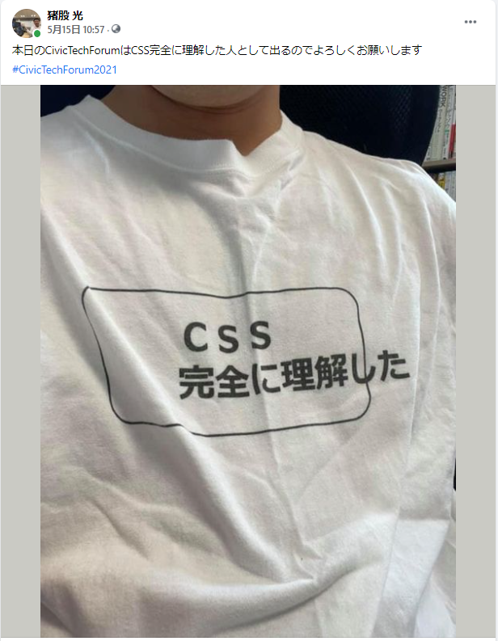
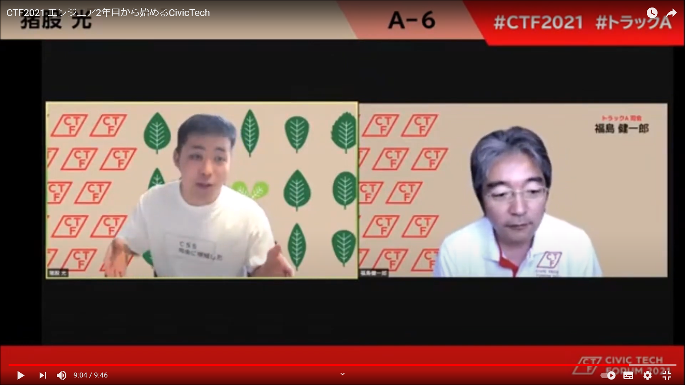
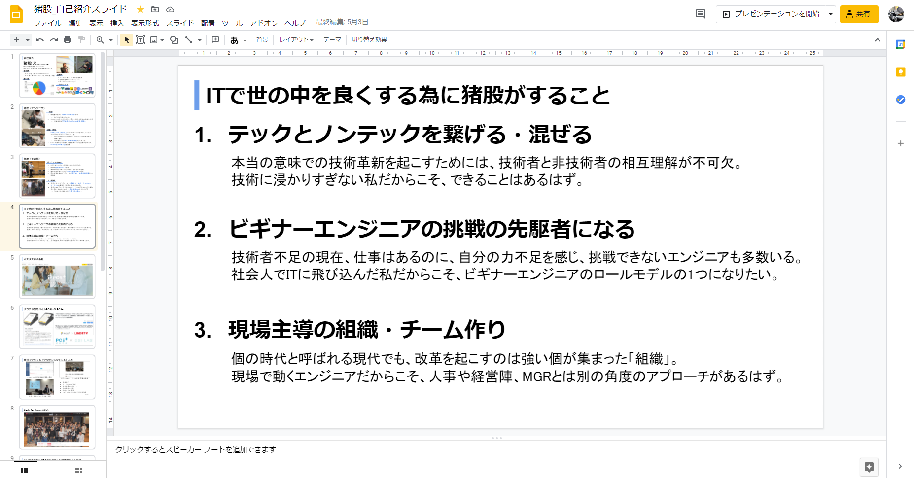

先日、5月15日にCivicTechForum2021が開催されまして、ルーキー枠で登壇させていただきました。

<iframe 
  class="hatenablogcard" 
  style="width:100%;height:155px;max-width:680px;"
  src="https://hatenablog-parts.com/embed?url=https://2021.civictechforum.jp/" 
  width="300" height="150" frameborder="0" scrolling="no">
</iframe>

去年は、CivicTech関連でジョインしていたチームのリーダーが出ていて、それをオンラインで見ていたので、1年経ってその場に私が出ていると思うと、とても感慨深いなぁと思います。

内省を含めてちょっと振り返ってみようかなと思って記事を書いてます。

# そもそもなんで出たの？

そもそも私自身人前で発表するのが好きな人間でして、人前で発表する機会があれば、相当なお門違いじゃない限り手を挙げるようにしています。

やはり自分で理解したと思っていても、資料にまとめて発表するとなると、全然考えがまとまっていなかったことがよく分かるし、発表した情報がオーディエンスの役に立ったという話を聞くと、すごい達成感とか満足感とかがあります。  
あと単純に人前で緊張せずにスマートに話せる人ってかっこいいスよね。ジョブズとか、ジョブズとか、ジョブズとか。

更に、今回に関しては、「ルーキー枠」なるものが設けられており、登壇者募集の時点で**「CivicTech始めたばっかりの人も是非！」**みたいな感じでした。

CivicTechに関わり始めて1年とちょっとだし、エンジニアとしても2年目が終わった頃だし、「ルーキー」っていう括りで言ったらちょうどええやろ！と思って割と気軽に応募しました。

まあその時は「『ルーキー枠』って言ってるぐらいだから、ワイみたいな『エンジニアなったばっかりで～～』みたいな人が集まるんやろな」と思ってたわけです。

# タイムテーブルが出てとてもビビるワイ

時は流れ、登壇者応募が締め切られ、登壇者のタイムテーブルが決まったわけです。

今までCivicTech関連での登壇は何回かやったことがあったので、今までの資料を参考にしながら、ちまちま資料を作ってたわけです。

そんな時にタイムテーブルを見て驚愕する訳です。

**「ルーキー枠で出んの？？？？こんなすごい人達が？？？？？」**

他の登壇者の方を見てみると、組織の代表とか、サービス作った人とか、なんかもうよく分からんけどタイトルからしてすげえ濃密な発表をするんだろうなとビビりまくりまして、資料を1から作り直しました。

ただ、勿論自分が今までやってきたことは変えられないので、意見の信憑性を上げるためにデータ持ってきたり、実例を出していいか許可取ったり、コピペだったところは作り直したり

あと発表練習もやりました。オンラインでの登壇だと発表練習は一人でZoom入って画面共有しながらレコーディングすれば、自分の発表練習の動画が気軽に撮れるので便利ですね。

そんなこんなで当日まで色々準備しました。

# そんでもって当日

まあ準備もしたことだし、オンラインなので多数のオーディエンスを目の前にしないというのもありまして、そんなに緊張することもなく。

なんか面白いことしたいなぁと思って当日色々と考えた挙げ句、「CSS完全に理解した」Tシャツで登壇しました。

そしていざ発表。Youtubeに登壇者ごとに切り分けられた動画が上がってました。

<iframe 
  class="hatenablogcard" 
  style="width:100%;height:155px;max-width:680px;"
  src="https://hatenablog-parts.com/embed?url=https://www.youtube.com/watch?v=3aB_ma6n2tI" 
  width="300" height="150" frameborder="0" scrolling="no">
</iframe>

改めて見ると若干早口ですね。発表時間の8分をオーバーすることは練習でもそんなになかったんですが、やっぱり発表当日は発表時間オーバーに若干ビビってましたね。  
結果7分もいかなかったような。タイムマネジメントが課題です。

結局Tシャツには誰も触れてくれなかった（っていうかTシャツの文字が読めるほど画質が良くなかった）んですが、発表後に司会の福島さんから「『来たれビギナー』って凄くいいですね」って言っていただいたり、Code for Japan代表理事の関さんからもYoutubeでコメント頂いたりと、色々と反応が頂けて、「あぁ準備してよかったなぁ」と一息つけました。

# 真面目な話

で、ここからは真面目な話。

個人的な行動指針として**「ビギナーエンジニアの挑戦の先駆者になる」**というのがあります。  
（確かこれもいつだったかの自己紹介スライドで作った）

「先駆者」って言うとなんか凄く聞こえるし、若干言い過ぎなところもあるんですが、  
実際私自身、エンジニアでありながら喋り好き、登壇好きっていう割と珍しいタイプなんじゃないかっていう自負はあります。

そんな私が色々表立って発表とかしてみて、他のエンジニアも**「あいつができるのであれば、私もできるんじゃないか」**と思ってくれれば良いなぁと思うわけです。

そうしてビギナーがもっと活発に発信できるような空気感ができれば、もっとITが広まるんじゃないかと思います。
 
 
 
 
IT技術者不足が叫ばれる現代ですが、ITの仕事が増える一方、技術者が増えていかない原因として、ITとは何をしているのかよく分からない、**ITのブラックボックス化**があるのかなぁと思っています。

建築、飲食など目に見える職業は割とやっていることのイメージが付きやすいですが、ITのエンジニアはひたすらに会社や家でPCに向かっていて、何をしているのか分からない。  
いざ説明を聞いてみると専門用語ばっかりでよく分からない。

エンジニアとしても、なにかに例えて説明はしてみるものの、なんか的を得ない。  
ちょっと説明が分かってもらえて、興味を持ってくれても、専門的な話になると明らかに理解してない顔をしている。

そんなこんなで、結局何をしているのか分からず、「とりあえずIT関連は分からんからエンジニアに丸投げしとけばどうにかなるだろ！」ってなっちゃうパターンも少なくないと思います。

そんなときの解決の糸口になるのは、すげえ人のすげえ話じゃなくて、**ITチョットワカル人のたどたどしい話じゃないかと思うんです。**

「なんかここらへんはよく分からんのやけど、こことここをこう繋げてみると自動化されて仕事がちょっと減る」とか、そんなもんでいいと思います。

それを、自分が作ったときの感動とかも含めて自分の言葉で伝えられれば、ITの垣根はもっと低くなるのかなぁと思います。

冒頭で、登壇した理由を話しましたが、実はもう一つ理由があり、それがこの**初学者の発信の垣根をもっと下げたい**というところです。

なんせ私もエンジニアで、日頃常々勉強はするもんで、どんどん初学者からは離れていってしまうので、名実ともに初学者と名乗れるうちにやるだけやってやろうと思ってます。
 
 
 
 
CivicTechForumでの発表というのも意味がありまして、  
最近のCivicTechの盛り上がりったらすごいじゃないですか。

東京都のコロナサイトをきっかけに知れ渡り、台湾のオードリー・タンさんの本も色々出ちゃったりして。

<iframe 
  class="hatenablogcard" 
  style="width:100%;height:155px;max-width:680px;"
  src="https://hatenablog-parts.com/embed?url=https://www.amazon.co.jp/%E3%82%AA%E3%83%BC%E3%83%89%E3%83%AA%E3%83%BC%E3%83%BB%E3%82%BF%E3%83%B3-%E3%83%87%E3%82%B8%E3%82%BF%E3%83%AB%E3%81%A8AI%E3%81%AE%E6%9C%AA%E6%9D%A5%E3%82%92%E8%AA%9E%E3%82%8B-ebook/dp/B08MF877HP/ref=sr_1_1?__mk_ja_JP=%E3%82%AB%E3%82%BF%E3%82%AB%E3%83%8A&crid=2C05LH8RHJ5G4&dchild=1&keywords=%E3%82%AA%E3%83%BC%E3%83%89%E3%83%AA%E3%83%BC%E3%82%BF%E3%83%B3&qid=1621259928&sprefix=%E3%82%AA%E3%83%BC%E3%83%89%E3%83%AA%E3%83%BC%2Caps%2C258&sr=8-1"
  width="300" height="150" frameborder="0" scrolling="no">
</iframe>

私がCivicTechに関わり始めた1年前がちょうと東京都のコロナ対策サイトをCode for Japanとかが関わって作ったみたいなニュースが出て、「台湾のIT大臣からプルリクが来た！！」とかTwitterが大騒ぎしてて、「Code for Japanってすげえなぁ」と思ってたんですが

CivicTechを推進し、ITを広めるためには**Code for Japan = すげえ人の集まり**ってなっちゃいけないんじゃないか？と思ったわけです。

なので、少しでもCivicTechにジョインする垣根が下がればいいなぁと思って登壇してみました。  
私の発表で「ああこんな簡単に活動できるのであれば、ちょっとやってもいいかもな」と思う人がいればいいなぁと思う限りです。

# おわり

1時間ぐらいでサクッと書ければいいなぁと思って書き始めた記事も、いざ書いてみれば2時間20分経過…

明日も仕事なので寝ます…

是非CivicTechとか興味持ってくれた方はCode for JapanのSlackに入ってもらって、@mattyってやつにお気軽に話しかけてくだされ！

<iframe 
  class="hatenablogcard" 
  style="width:100%;height:155px;max-width:680px;"
  src="https://hatenablog-parts.com/embed?url=https://www.code4japan.org/activity/community"
  width="300" height="150" frameborder="0" scrolling="no">
</iframe>

私が現在活動しているNPTechの方でもSTOってやつやってるので、是非こちらもよろしくッ！！！  

<iframe 
  class="hatenablogcard" 
  style="width:100%;height:155px;max-width:680px;"
  src="https://hatenablog-parts.com/embed?url=https://sto.code4japan.org/"
  width="300" height="150" frameborder="0" scrolling="no">
</iframe>