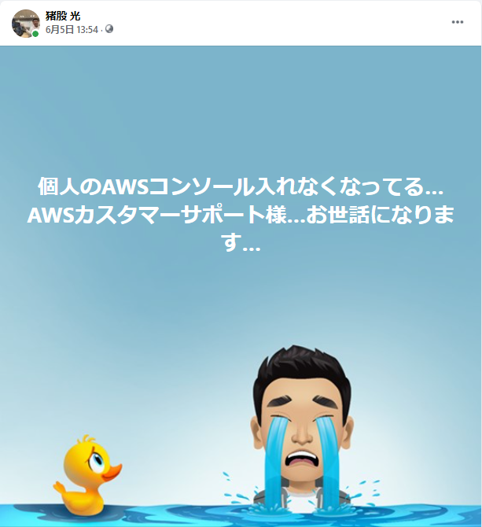

# 個人的にAWSカスタマーサポートにお世話になる

この前の土曜日にAWSでちょっとやりたいことがあったので、AWSを使おうとしたんですよ。  
いつもどおりAWSコンソールのログイン画面を開いて、Chromeが記憶しているIDとパスワードを打ち込んで、ログイン！

あれ、ログインできない…？

以前の作業でユーザー周りをいじったときに、変なパスワードをChromeに記憶させちゃってて、ログインができなくなってました…

クソ…ID/Passどこかに控えとくべきだった…  
仕方ない…Rootアカウントで入るか…

AWSを普段から利用する方はご存知だと思いますが、AWSにはアカウントを作った時に発行される、Rootアカウントという、何でもできる最強アカウントがあります。  
Rootアカウントは最強が故に、アカウント情報が人にバレると、そのAWSアカウントでやりたい放題になるので、一般的にはRootアカウントでひとしきり設定を終えたら、別の作業用アカウントを作り、そちらで作業を行います。

RootアカウントのIDとPass入れて… ログイン！

**「MFAデバイスを確認して以下に認証コードを入力します。」**

MFA…？

そうです、Rootアカウントは最強アカウントであるが故、ID/Passの認証だけではなく、MFA(多要素認証)という方式でログイン認証を行います。

要は、ID/Passとその他のいくつかの要素を組み合わせてログイン認証を行うんですね。

メジャーなのはワンタイムパスワードという方式で、ユーザーのスマホにランダムな数列を表示するアプリを入れて、その数列を打ち込んで認証を行うというものです。

Google Authenticatorというアプリを使ったりしますね。

<iframe 
  class="hatenablogcard" 
  style="width:100%;height:155px;max-width:680px;"
  src="https://hatenablog-parts.com/embed?url=https://apps.apple.com/jp/app/google-authenticator/id388497605"
  width="300" height="150" frameborder="0" scrolling="no">
</iframe>

このスマホのアプリと、アカウント情報が裏で紐付いているため、ID/Passを知っている、かつ、認証されたスマホを持っているユーザーに対し、認証を許可する訳です。

そして私も例に漏れず、Google Authenticatorを使っていました。

MFAか…どの数列だ…？
 
 
 
 
**あれ…？無い…？**

そうです。数ヶ月前に変えたスマホから、Google Authenticatorの情報を移行していなかったのです。

基本的にAWSのRootアカウントには滅多なことが無いとログインしないため、Google AuthenticatorにRootアカウントのMFAの情報がなくても今まで一度も困りませんでした。

クソ…AWSの基本的なルールを守ってきたが為に…（移行しないのが悪い）

一応MFA認証以外の方法として、メールアドレスと電話番号で認証する方法もあったのですが、どうやら以前打ち込んだ電話番号が間違っていたらしく**「電話番号が不正です」**という表示が…  
とことんツイてない…

要はこの時点で、私は私個人の力ではAWSアカウントに入れなくなったわけです。「積み」です。

こうした迷える子羊を救う最後の策として、AWSのカスタマーサポートという手があります。

専用ページから、MFA認証ができなくて困っているアカウントの情報を入力すると、後日連絡が来て対応してくれるというものです。  
すがる思いでこちらに入力しました。

**日本時間の平日 9:00 - 18:00 の間に日本の担当者より折り返しご連絡いたします。**

ああそうですか…私はもうこの土日はAWSいじれないわけですね…　　そうですか…

# カスタマーサポートから電話が来る

そんな土日を過ごし、本日、月曜。

さあ、仕事を始めよう、とチャットやらメールやらを確認している間に1本の電話が。  
知らない番号です。

**「ああ、AWSか」**と思いましたが、どうやら仙台から電話してるっぽい。

「AWSって仙台にもあんのかな？」と思いながら電話に出ました。  
以下、うろ覚えだけど、電話の内容です。
 
 
 
 
～～～～～～～～～～～～～～～～～

CS（カスタマーサポート）「AWSカスタマーサポートの〇〇です。猪股さんの番号でお間違い無いでしょうか？」

猪股「あ、そうです～～猪股です。」

CS「先日ご連絡いただいたAWSアカウントのMFA認証の解除の件でお電話させていただきました。こちらのお電話はサービス品質向上のために録音させていただいておりますが、よろしいでしょうか？」

猪股「大丈夫です～～」（そういうのも口頭で言うんやな）

CS「では早速なんですが、お客様のメールアドレスをアルファベット一文字ずつ、言って頂けますか？」

※私のメアドがmatty@gmail.comとします。  
猪股「えーっと、エム、エー、ティ、ティ、ワイ」（相手からの相槌を待つ）

CS「」

（特に相槌しないのか）  
猪股「アットマーク、ジーメールドットコムです」

CS「確認できました。では只今そちらのメールアドレスに8桁の番号が書いてあるメールを送ったので、その8桁の数字をご確認して頂けますか？」

猪股「あー、はい。これか。えーっと、1,2,6,7」（相手からの相槌を待つ）

CS「」

（相槌ないのね）  
猪股「5,6,9,3です」

CS「はい、確認できました。そうしましたら、只今MFAを解除致しましたので、メールアドレスと以前設定していただいたパスワードでログインできるかと思います。」

猪股「ありがとうございます～～ お手数おかけしました～～」

CS「はい、では〇〇が担当させていただきました。ありがとうございました。」

猪股「ありがとうございました～」

ガチャッ

～～～～～～～～～～～～～～～～～
 
 
 
 
自分のAWSのRootアカウントで入ってみると、無事入れました。一安心。よかったよかった。

ただ、仕事をしながら会話を振り返ってみると、一つある疑問が。

**CSの〇〇さんって人間か…？**

# 疑惑の理由

AWSにはAmazon Connectというクラウドコンタクトセンターの機能があります。

<iframe 
  class="hatenablogcard" 
  style="width:100%;height:155px;max-width:680px;"
  src="https://hatenablog-parts.com/embed?url=https://aws.amazon.com/jp/connect/"
  width="300" height="150" frameborder="0" scrolling="no">
</iframe>

これは既存のコンタクトセンターの業務を、チャットボットやワークフローで置き換えることができる他、音声認識なども行います。

更には皆さんご存知、Alexaで人の声が出せることは分かっていますし、つい先日、今年の4月にAmazon Lexというチャットボット向けの会話形AIを提供するサービスが、日本語に対応したことが発表されました。

<iframe 
  class="hatenablogcard" 
  style="width:100%;height:155px;max-width:680px;"
  src="https://hatenablog-parts.com/embed?url=https://aws.amazon.com/jp/blogs/news/amazon-lex-tokyo/"
  width="300" height="150" frameborder="0" scrolling="no">
</iframe>

要は、ここらへんの技術を組み合わせれば、このぐらいのカスタマーサポートはAIで作れるんじゃないか…？と思ったわけです。
 
 
 
通話の内容を振り返ってみると、私が聞かれたのは「メールアドレス」「8桁の数字」の2つです。

しかもメールアドレスに関して言うと、「アルファベット一文字ずつ」というプロトコルを相手から指定されている訳です。

メールアドレスのドメインは一気に言いましたが、日本のメジャーなドメインなんかたかが知れているので、私の言葉を音声認識でメールアドレスのドメインに変更することなど造作もないことでしょう。

仮に、一般的ではない、会社のメールアドレスのドメインとかを言っていたら「すいません。〇〇っていうスペルがわからないのですが、アルファベットで言って頂けますか？」とか言われたんですかね…？  
試してみりゃよかった…

更には、メールアドレスや番号を伝えてる間の相槌がなかったのも、今思えば違和感…  
そういえばAWSの本社って目黒にあるのに、なんで仙台から電話きたんだ…？

考えれば考えるほど怪しくなってきます。

仮にこれがAIだった場合、とんでもなく自然だったし、全く普通のカスタマーサポートと変わらないレベルでした。

実際のところどうなのかは分かりませんが、これが本当にAIかもしれないと思わせるAWSには本当に驚かされるばかりです。

私がデジタルに触れすぎて頭おかしくなってるのか、本当にAIなのか…　真実は闇の中…

# 後日談①

ワイ「…っていうことがあったんですよ～～ マジでAIっていう可能性もありえるかもしれんすよね？？？ やっぱり将来的にはこういうところで人間が価値発揮しなくても良くなるんすかねー？　すげーな～～！」

先輩「MFA忘れるぐらいのバカにはわざわざ人間が価値提供することもないってことだな」

ワイ「」（震えることしかできない）

# 後日談②

調べてみたら仙台にAWSのテクニカルオペレーションを請け負ってる会社があるんですねｗ

<iframe 
  class="hatenablogcard" 
  style="width:100%;height:155px;max-width:680px;"
  src="https://hatenablog-parts.com/embed?url=https://www.green-japan.com/job/116992?argument=sRrG93Nh&dmai=kbox_eng-sys_oth&argument=sRrG93Nh&dmai=kbox_eng-sys_oth"
  width="300" height="150" frameborder="0" scrolling="no">
</iframe>

多分ここだわｗ

そもそもAIだったら土日休みにする意味が分からんし笑