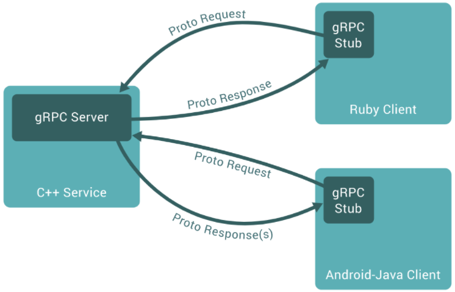
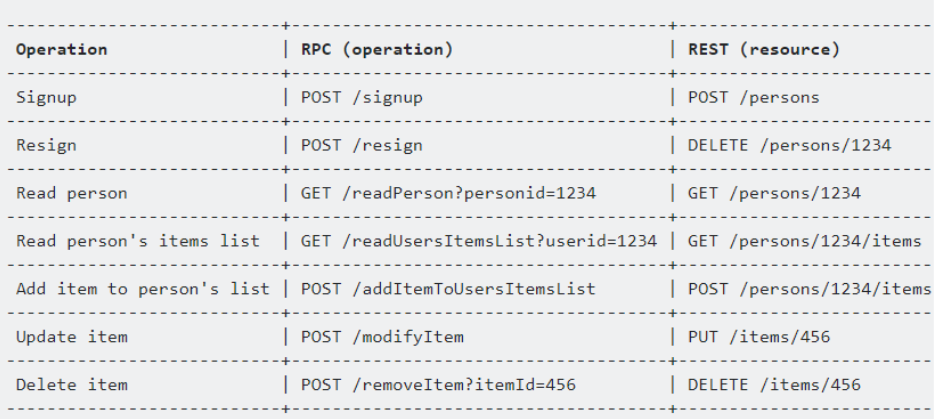

会社でgRPCを導入する方針があり、gRPCについて色々調べてみたのでまとめてみます。

私が現在分からないところを、私が分かる言葉の組み合わせで説明できるまで噛み砕くように調べたので、調べる粒度とかはバラバラです。私がgRPCを理解できること、それが本記事の主目的である。

# gRPCってなんやねん
- Google で開発された多言語間のRemote Procedure Call (RPC) を実現するプロトコル
- IDL としては Protocol Buffers が使われている。
- 通信には HTTP/2 の枠組みが利用されている。

 
軽く調べてみると、上記の説明がサラッと書いてあるので、ここから噛み砕いていきます。

## じゃあRPCってなんなのよ
- 上記の通りRemote Procedure Callの略で、外部のプログラムが提供するプロシージャを呼び出す仕組み。
- 各言語の普通の関数（stub 関数）を呼び出すとライブラリがネットワーク通信して外部で動作しているサーバーにリクエストを投げ、結果を受け取って関数の戻り値として返す。
- RPC の利用者視点ではネットワークや他の言語の知識を必要とすることなく、ただの関数として利用できる。
- 異なる言語間で RPC として呼び出せる関数を定義する場合、特定の言語に依らない独立の定義方法が必要になる。
  - RPCの関数やその引数を定義する言語を **Interface Description Language (IDL)** という。

 
gRPCのサーバーとクライアントの関係が 以下のページに図で説明されております。

<iframe 
  class="hatenablogcard" 
  style="width:100%;height:155px;max-width:680px;"
  src="https://hatenablog-parts.com/embed?url=https://www.grpc.io/docs/what-is-grpc/introduction/" 
  width="300" height="150" frameborder="0" scrolling="no">
</iframe>

Rubyクライアントからでも、Android-Javaクライアントからでも、stubとしてC++で書かれているgRPCサーバーの関数を使えるというイメージが、見て分かるかと思います。

## じゃあIDLってなんなのよ
- 上記の通り、RPCの関数やその引数を定義する言語のこと
- IDL にはコンパイラが付属し、サポートしている言語用に関数呼び出しのためのコードを自動生成する。
  - 例えばクライアントが Python でサーバーが Go の場合、Python の文字列リストをネットワークで送れるようバイト列にserializeし、Go では受け取ったバイト列を deserialize して Goの文字列スライスするような serialize / deserialize コードをIDL コンパイラが生成してくれる。

## じゃあProtocol buffersってなんなのよ
- スキーマ言語の一種
- 簡素で可読で、プログラミング言語から独立で、任意のデータを表現できるわけではないが十分に適用可能範囲が広い。
- 仕様が小さいので、実装間の意図せぬ非互換性で苦しめられることが少ない。
- Protocol Buffersのversion 3からは、Jsonとの相互変換の規則が仕様として定められてる。

## え、HTTP/2ってなんだっけ
- 従来使われてきたHTTP/1.1では、ウェブサーバーに対して原則1つずつしかリクエストを送ることができなかった。一方、新しく登場したHTTP/2では、複数のリクエストを同時に処理することができる。

# 中間まとめ
上記より、**gRPCってなんやねん**の説明を噛み砕いてみます。

- Google で開発された多言語間のRemote Procedure Call(外部のプログラムが提供するプロシージャを呼び出す仕組み)を実現するプロトコル
- IDL (RPCの関数やその引数を定義する言語) としては Protocol Buffers (スキーマ言語の一種) が使われている。
  - 普通のRPCであれば、Java IDLとかでも書けるっぽい。
- 通信には HTTP/2 (HTTP/1.1から複数リクエストを同時に処理できるようになったプロトコル)の枠組みが利用されている。
 
 
よしよし、だいぶ分かってきた。  
ここからちょっと気になったことを調べます。

# APIとの関係は？
「じゃあRPCってなんなのよ」にて、RPCは**外部のプログラムが提供するプロシージャを呼び出す仕組み**だという説明がありましたが、これは要するにAPIよね？？ってのが気になりました。
ちょっと調べてみると、そのとおりだったみたいで、SOAP,REST,GraphQLなどと肩を並べて比較されるAPIアーキテクチャの一種みたいです。

## RPCとRESTの比較

以下の記事にて、分かりやすく説明されておりました。

<iframe 
  class="hatenablogcard" 
  style="width:100%;height:155px;max-width:680px;"
  src="https://hatenablog-parts.com/embed?url=https://tokidoki-web.com/2021/03/rest-apirpcweb/" 
  width="300" height="150" frameborder="0" scrolling="no">
</iframe>

### RPC形式のメリット
- 複数言語に渡るプログラム間で条件分岐する場合でも直接メソッドでの操作が可能
- 仕様によってはGETかPOSTかすら気にせず、すべてPOSTで対応可能なシンプルさ
- メソッドが直接エンドポイントに作用するので機能追加がしやすい
- ペイロードが軽量になるので最善なパフォーマンスがで出やすい

### REST形式のメリット
- フロントエンドで使われる技術をそのまま使える(JSが扱いやすいJSONベース)ので汎用性が高い
- HTTPプロトコルによって一貫性かつ互換性のある操作を行える(登録はPOST、取得はGET、削除はDELETEなど)
- URLを検索することで、URLの機能とそのレスポンス情報を解読しやすい＆エンドポイントを見ればどういうデータが行き交ったのかが理解しやすい
- サーバー側とは受け取るリソースのみの認識共有で済むので、フロントとバックがそれぞれの相互依存気にせず開発に集中できる

### URLの違い
RPCとRESTはURLにも違いが出るようで、それに関しては以下の記事に画像が乗ってました。

<iframe 
  class="hatenablogcard" 
  style="width:100%;height:155px;max-width:680px;"
  src="https://hatenablog-parts.com/embed?url=https://ichi.pro/api-a-kitekucha-sutairu-no-hikaku-soap-rest-graphql-rpc-145837527850746" 
  width="300" height="150" frameborder="0" scrolling="no">
</iframe>

見た感じ、以下の記事の日本語訳っぽいですね

<iframe 
  class="hatenablogcard" 
  style="width:100%;height:155px;max-width:680px;"
  src="https://hatenablog-parts.com/embed?url=https://www.altexsoft.com/blog/soap-vs-rest-vs-graphql-vs-rpc/" 
  width="300" height="150" frameborder="0" scrolling="no">
</iframe>

「～をする」ということをURLに明記する、いわば動詞を記載するRPCと、「～がほしい」といった、明示的にユニークキーなどを指定する、いわば名詞を記載するRESTというところで違いがあるそう。
 
 
 
 
その他、SOAP,REST,RCP,GraphQLの比較表などもあるので、上記の記事はAPI設計の際にはかなり参考になりそうですね。
 
 
とりあえずgRPCとかRPCの概要は理解できたので、めでたしめでたし。

# 参考資料
いろいろ参考にさせていただきました。
特に、一番上に記載した、サイボウズの社内研修向け資料は、サンプルコードなどもあって、大変参考になりました。

<iframe 
  class="hatenablogcard" 
  style="width:100%;height:155px;max-width:680px;"
  src="https://hatenablog-parts.com/embed?url=https://github.com/ymmt2005/grpc-tutorial" 
  width="300" height="150" frameborder="0" scrolling="no">
</iframe>

- [ymmt2005/grpc-tutorial: gRPC tutorial for Japanese readers](https://github.com/ymmt2005/grpc-tutorial)
- [gRPCって何？](https://qiita.com/oohira/items/63b5ccb2bf1a913659d6)
- [関数、メソッド、プロシージャ。それぞれの違いは？](https://stonebeach-dakar.hatenablog.com/entry/2016/11/22/072344)
- [今さらProtocol Buffersと、手に馴染む道具の話](https://qiita.com/yugui/items/160737021d25d761b353)
- [スキーマ言語とは｜「分かりそう」で「分からない」でも「分かった」気になれるIT用語辞典](https://wa3.i-3-i.info/word13412.html)
- [gRPC docs: Introduction to gRPC](https://www.grpc.io/docs/what-is-grpc/introduction/)
- [【図解】HTTP/2って？HTTP/1.1との違いと導入メリット・課題まとめ | カゴヤのサーバー研究室](https://www.kagoya.jp/howto/webhomepage/http-2/)
- [API 設計: gRPC、OpenAPI、REST の概要と、それらを使用するタイミングを理解する](https://cloud.google.com/blog/ja/products/api-management/understanding-grpc-openapi-and-rest-and-when-to-use-them)
- [REST APIとRPCによるアーキテクチャの違いをまとめてやんよ!!!](https://tokidoki-web.com/2021/03/rest-apirpcweb/)
- [Comparing API Architectural Styles: SOAP vs REST vs GraphQL vs RPC](https://www.altexsoft.com/blog/soap-vs-rest-vs-graphql-vs-rpc/)
- [APIアーキテクチャスタイルの比較：SOAP、REST、GraphQL、RPC](https://ichi.pro/api-a-kitekucha-sutairu-no-hikaku-soap-rest-graphql-rpc-145837527850746)
- [Jsonとの相互変換 · HonKit](https://xuwei-k.github.io/scala-protobuf-docs/json.html)
- [Java IDL 入門: インタフェース定義の記述](https://docs.oracle.com/javase/jp/1.5.0/guide/idl/tutorial/GSIDL.html)