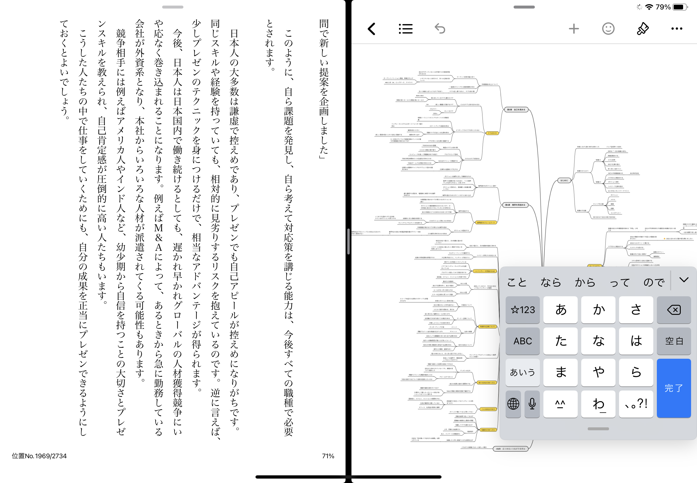

マインドマップツールを悩みに悩んだ結果、xmindと共に生きると決めてみたmattyです。

皆さんはマインドマップ使いますか？  
私は割とよく使います。

主に一人で考え事をするときには、マインドマップでまとめる癖があります。

以前はドキュメントに箇条書きでインデントつけてまとめてたんですが、インデントの階層が増えるにつれ、自分は今何について書いているのか分からなくなったり、階層の粒度がバラバラになったりするのが気持ち悪くてマインドマップを使い始めました。

# マインドマップ使用歴
## MindMeisterとの出会い
そもそもマインドマップというものを知ったのが、大学の時に参加した勉強会だったんですが、勉強会で講師をやっていた人が、本の要約をマインドマップでまとめていて、それが衝撃的に見やすかったという思い出があります。

すぐにその講師の人に、ツールを教えてもらい、そこで出会ったのが、**MindMeister**です。

<iframe 
  class="hatenablogcard" 
  style="width:100%;height:155px;max-width:680px;"
  src="https://hatenablog-parts.com/embed?url=https://www.mindmeister.com/ja" 
  width="300" height="150" frameborder="0" scrolling="no">
</iframe>

Webで動くので、特にデスクトップアプリを入れることもなく、ユーザー登録だけで使えます。

そもそもこの当時はマインドマップというものを初めて知り、MindMeister以外のマインドマップがあるなんて知る由もなかったので、MindMeisterを使いまくってました。  
特にカジュアルなMTGの議事録としては割と使い勝手がよく、その後URLを共有すると他の人からも編集してもらえるため、よく使っていました。

しかし、欠点として、無料枠では3つまでしかマインドマップが作れないことです。

まあMTG自体もカジュアルなものだったため、「まあそんなに長期間残さなくてもいいか」ということで、4つ目のマインドマップを作りたかったら消すということを繰り返しました。

## MindMup2を使い始める

なんだかんだで、MindMeisterを1年ほど使い続けたんですが、自分の中でマインドマップのあの脳のシナプスを可視化してる感じがバッチリハマり、徐々に使う頻度が増えていった結果、MindMeisterの無料枠だと限界が来ました。

有料版にアップデートすることも考えましたが、ちょっと他も見てみようと思いたち、調べた結果見つかったのが**MindMup2**です。

<iframe 
  class="hatenablogcard" 
  style="width:100%;height:155px;max-width:680px;"
  src="https://hatenablog-parts.com/embed?url=https://drive.mindmup.com/" 
  width="300" height="150" frameborder="0" scrolling="no">
</iframe>

こちらはGoogleドライブにマインドマップを保存することができます。マップ数に制限はなく、すげえいいじゃん！と思って使ってみることにしました。

しかし、UIがMindMeisterに比べてちょっとダサかったり、一度マインドマップを公開すると一定期間は公開が取り消せないという謎仕様があったりと、少し不満な点もあり、MindMeisterとMindMup2をどちらも使う日々が続きます。

## xmindを使い始める

自分の欲を満たしてくれるマインドマップは無いかと、試行錯誤をする日が続き、最終的に**xmind**にたどり着きました。

<iframe 
  class="hatenablogcard" 
  style="width:100%;height:155px;max-width:680px;"
  src="https://hatenablog-parts.com/embed?url=https://jp.xmind.net/" 
  width="300" height="150" frameborder="0" scrolling="no">
</iframe>

後日談ですが、マインドマップの老舗といったらxmindらしいですね。知らんかった。

こちらはデスクトップアプリを入れる必要があります。  
また、作成したマインドマップは .xmind という拡張子でローカルに保存されます。

最初の頃は、MindMeister, MindMup2, xmindを並行して使ってましたが、悩んだ結果思い切ってxmind1本に絞ってみました。  
そうしたらちょっと幸せになりました。

# xmindのいいところ
## ユーザー登録がいらない

そう。xmindはユーザー登録がいらないんです。

勿論ユーザー登録機能はあり、これをするとそれなりの特典はあるみたいなんですが、ユーザー登録しなくても、デスクトップアプリさえ入れれば十分使えます。

## ローカルファイル保存というスタイルが思考にとても合っている

xmindのローカルファイル保存というスタイルなんですが、これは一見短所かと思いきや、私は長所だと思っています。  
まあ近年のSaaSブームと逆行している感じはありますが、「マインドマップ」というサービスにおいてはローカルファイル保存でいいんじゃないかと思うんです。

勿論第一の利点として、マップの作成枚数に制限が無いと言うのがあります。サービスベンダー側のストレージ使ってるわけじゃないしね。
 
 
 
 
また、ローカルファイル保存だと、何かプロダクトを作ろうとしたディレクトリのルートディレクトリに、**「初期構想.xmind」**とかいう形で置いておけます。  
しかし、これがクラウドにあると、ディレクトリとマインドマップの紐付けができない。URL書いたファイルとか置いときゃできるけども、なんか直感的じゃないんすよねぇ。

また、私はマインドマップはあくまで「思考の可視化」だと思っています。  
そんなマインドマップをSaaSサービスで使うとなると、仮に用途によって、複数のアカウントを保持している場合（仕事用のアカウント、私用のアカウントなど）、同じ人間なのに思考がサービスによって分断されるという奇妙なことが起こります。

しかし、ローカルファイル保存だと、ファイルのやり取りさえできれば、どのデバイスでも同じマインドマップを扱える訳です。

結局使うシーンで、ユーザーについている肩書は違くても（趣味での開発、読書ログ、仕事の立案など）、使ってる人間は同じわけですから、同じストレージに保存できる方がUXとして自然だと思ったわけです。

## iPadアプリのUIが素晴らしい

というかタッチデバイス×ブラウザ×マインドマップの食い合わせが最悪。MindMup2、お前のことだぞ。  
MindMeisterはネイティブアプリあるからよし。

画面スクロールしようとすると、アイテム移動になっちゃって、変なところにアイテムが紐付いちゃったりして、戻すのめんどくさいし、

一生懸命考えようとしている時に、そういうチマチマしたストレスを抱えたくないというのがあります。

その一方、xmindのネイティブアプリはとてもよい。  
アイテムの色とか形とかもバリエーション豊富だし、アイテムに付けられるスタンプみたいなやつ可愛いし。

最近のお気に入りの使い方は、iPadの左半分でkindleを開いて、右半分にxmindを開いて、読書ログをマインドマップでまとめるという方法です。

文字入力のインターフェイスも、キーボードじゃなくて、スマホ用のちっちゃいやつにしてるので、左手でページをめくりながら、右手でマインドマップ操作ということができます。

作成したファイルはiCloud Driveに保存して、PCでダウンロードできるようにしてあるので、勿論PCでも参照できます。

私はPCはWindowsなんですが、完全にappleのエコシステムの中で生きてる人であれば、ここのiCloud Driveの連携とかもメチャクチャいいんだろうなぁと想像してます。M1 macbookほしい。

# 反論に答える
## 議事録で使ってるとか言ってたのはどうなったんだ馬鹿野郎！

やめました。

大きな理由としては、マインドマップは時間軸を表現できないからです。

あくまで一人の人間の考えの広がりを表現するツールであるため、そこに明確な時間軸はありません。

一般的な議事録は、ドキュメントで、上から下に流れ、暗黙の了解として下に行くにつれて新しい情報として理解されます。  
それによって、「〇〇さんの質問に対して、xxさんが～～～と答えた」というのを理解しているわけですが、マインドマップだとそれが難しい。

「カジュアルな会議」と言っていたのは、人同士の議論があまり発展しない、ブレインストーミングのようなMTGを指していたので、序盤はあまり困らなかったのですが、ブレインストーミングが発展して議論になるなんてことは往々にしてあり（ファシリの質としてどうなんだという問題は置いといて）、こういうMTGの議事録をマインドマップで取り始めると、結構大変だったのでやめました。

## 同時編集できねぇじゃねぇか馬鹿野郎！

そうです。xmindはローカルファイル保存であるため、同時編集はできません。  
せめてやるとしたら、ローカルファイルを渡して、編集してもらって、返してもらうとか。とても非同期。

ただ、考えてみてください。
 
 
 
 

**同時編集いるか？？？？**
 
 
 
 
MindMeisterを使ってた頃はURL共有して、同時編集とかやってましたが、マインドマップを共同編集する恩恵があまり感じられなかったんですよね。

ブレインストーミングであれば、ホワイトボードツールのMiroとかJamboardとかの方が適してると思うし、

<iframe 
  class="hatenablogcard" 
  style="width:100%;height:155px;max-width:680px;"
  src="https://hatenablog-parts.com/embed?url=https://miro.com/index/" 
  width="300" height="150" frameborder="0" scrolling="no">
</iframe>
 
<iframe 
  class="hatenablogcard" 
  style="width:100%;height:155px;max-width:680px;"
  src="https://hatenablog-parts.com/embed?url=https://workspace.google.co.jp/intl/ja/products/jamboard/" 
  width="300" height="150" frameborder="0" scrolling="no">
</iframe>

ドキュメント編集であれば、Google Docsでいいし、

<iframe 
  class="hatenablogcard" 
  style="width:100%;height:155px;max-width:680px;"
  src="https://hatenablog-parts.com/embed?url=https://www.g-workspace.jp/googleworkspace/docs/" 
  width="300" height="150" frameborder="0" scrolling="no">
</iframe>

最初はマインドマップを使えることが楽しくて、MindMeisterで同時編集とかしてみましたが、ある程度慣れて、落ち着いて考えてみると、そんなに意味ないんじゃね？っていう結論に落ち着きました。

そもそも、マインドマップの階層の切り方って人によってすごい変わるので、長時間同時編集すると結構粒度がぐちゃぐちゃになることがあり、「ああ、これは同時編集とかやるもんじゃないんだな」という教訓を得ました。

## お前以外が編集する場合、アプリ入れないと編集できねぇじゃねぇか馬鹿野郎！

うん。それは、すまん。

ただ、閲覧だけであれば、HTMLとかPDFとかにエクスポートできるから許して。

編集は…　うん…　すまん。

# まとめ

ということで、一旦xmindと共に生きると決めてみました。  
1ヶ月ほど使ってみてますが、UXとしてもとてもストレスなく使えてます。

まあ、ツールなんてポケモンの御三家みたいに、「君に決めた！」とか言ってても、後から通信交換でも、データ削除して1から再スタートでも変えられるので、一旦相棒は決めてみたものの、場合によっちゃバッサリ切り落とします。

ユーザーとツールの関係なんて所詮そんなもんです。素直に使いやすいツールを追い求めて、乗り換えればいいんですよ。

最後に聞いてください。反町隆史で、「POISON　～言いたいことも言えないこんな世の中は～」

～～～～

汚い嘘や言葉で操られたくない　POISON  
素直な気持ちから目をそらしたくない

言いたいことも言えないこんな世の中じゃ　POISON  
俺は俺を騙すことなく生きていく　OH OH

～～～～

<iframe width="560" height="315" src="https://www.youtube.com/embed/_UWZYVcMlVY" title="YouTube video player" frameborder="0" allow="accelerometer; autoplay; clipboard-write; encrypted-media; gyroscope; picture-in-picture" allowfullscreen></iframe>