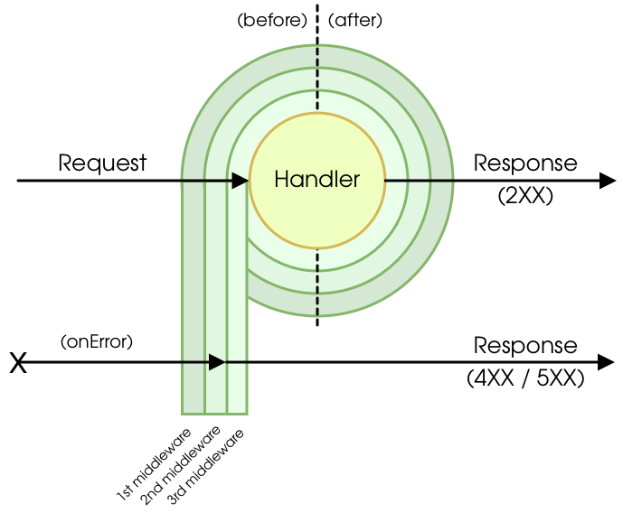

middyっていう知らんやつがいたので、ちょっと調べてみる

まあほぼ以下の公式ドキュメントを日本語訳して、わかりにくいところを言い換えた感じ

<iframe 
  class="hatenablogcard" 
  style="width:100%;height:155px;max-width:680px;"
  src="https://hatenablog-parts.com/embed?url=https://middy.js.org/" 
  width="300" height="150" frameborder="0" scrolling="no">
</iframe>

- AWS LambdaをNode.jsで書く時にコードを簡略化できるミドルウェアエンジン
- 一般的なJS系のWebフレームワークでは、ハンドラ作成時に本来ビジネスロジックに書きたくない、入力の解析と検証、出力のシリアル化、エラー処理などをミドルウェアパターンとして提供しているが、AWS Lambdaのハンドラに対して同様のアプローチが見つからなかったため、middyを作ったらしい

# 利用例

公式ドキュメントに載っていた、支払い処理のAPIの例

```jsx
//# handler.js #

// import core
import middy from '@middy/core' // esm Node v14+
//const middy = require('@middy/core') // commonjs Node v12+

// import some middlewares
import jsonBodyParser from '@middy/http-json-body-parser'
import httpErrorHandler from '@middy/http-error-handler'
import validator from '@middy/validator'

// This is your common handler, in no way different than what you are used to doing every day in AWS Lambda
const baseHandler = async (event, context, callback) => {
 // we don't need to deserialize the body ourself as a middleware will be used to do that
 const { creditCardNumber, expiryMonth, expiryYear, cvc, nameOnCard, amount } = event.body

 // do stuff with this data
 // ...

 return { result: 'success', message: 'payment processed correctly'}
}

// Notice that in the handler you only added base business logic (no deserialization,
// validation or error handler), we will add the rest with middlewares

const inputSchema = {
 type: 'object',
 properties: {
   body: {
     type: 'object',
     properties: {
       creditCardNumber: { type: 'string', minLength: 12, maxLength: 19, pattern: '\d+' },
       expiryMonth: { type: 'integer', minimum: 1, maximum: 12 },
       expiryYear: { type: 'integer', minimum: 2017, maximum: 2027 },
       cvc: { type: 'string', minLength: 3, maxLength: 4, pattern: '\d+' },
       nameOnCard: { type: 'string' },
       amount: { type: 'number' }
     },
     required: ['creditCardNumber'] // Insert here all required event properties
   }
 }
}

// Let's "middyfy" our handler, then we will be able to attach middlewares to it
const handler = middy(baseHandler)
  .use(jsonBodyParser()) // parses the request body when it's a JSON and converts it to an object
  .use(validator({inputSchema})) // validates the input
  .use(httpErrorHandler()) // handles common http errors and returns proper responses

module.exports = { handler }
```

# 実装方法

```jsx
import middy from '@middy/core'
import middleware1 from 'sample-middleware1'
import middleware2 from 'sample-middleware2'
import middleware3 from 'sample-middleware3'

const baseHandler = (event, context) => {
  /* your business logic */
}

const handler = middy(baseHandler)

handler
  .use(middleware1())
  .use(middleware2())
  .use(middleware3())

module.exports = { handler }
```

1. Lambdaハンドラの中にビジネスロジックを記載
2. middyとその他利用するミドルウェアをimport
3. middy関数でハンドラをラップして、利用するミドルウェアをuseで呼び出す

上記のように、3つのミドルウェアが呼び出されていると、ビジネスロジックをラップしたハンドラを含めて、以下のような実行順になる。

1. middleware1(before)
2. middleware2(before)
3. middleware3(before)
4. handler
5. middleware3(after)
6. middleware2(after)
7. middleware1(after)

公式ドキュメントでは「玉ねぎのようなミドルウェアパターン」と言われてます。  


# ミドルウェアの実装

middyが用意しているミドルウェア（[こちら](https://middy.js.org/) のAvailable middlewares参照）はあるが、ミドルウェアを自分で実装することも可能

サンプルコード

```jsx
// customMiddleware.js

const defaults = {}

module.exports = (opts = {}) => {
  const options = { ...defaults, ...opts }

  const customMiddlewareBefore = async (request) => {
    // might read options
  }
  const customMiddlewareAfter = async (request) => {
    // might read options 
  }
  const customMiddlewareOnError = async (request) => {
    // might read options
  }
  
  return {
    // Having descriptive function names will allow for easier tracking of perormance bottlenecks using @middy/core/profiler
    before: customMiddlewareBefore,
    after: customMiddlewareAfter,
    onError: customMiddlewareOnError
  }
}
```

ミドルウェアは

- before(beforeフェーズで実行される)
- after(afterフェーズで実行される)
- onError(エラーが発生した時に実行される)

の3つのキーのうち、少なくとも1つを返す必要がある。

再利用しないミドルウェアはインラインミドルウェアという形で、ビジネスロジックと同じクラスに記載することもできる。

```jsx
import middy from '@middy/core'

const handler = middy((event, context) => {
  // do stuff
})

handler.before(async (request) => {
  // do something in the before phase
})

handler.after(async (request) => {
  // do something in the after phase
})

handler.onError(async (request) => {
  // do something in the on error phase
})

module.exports = { handler }
```