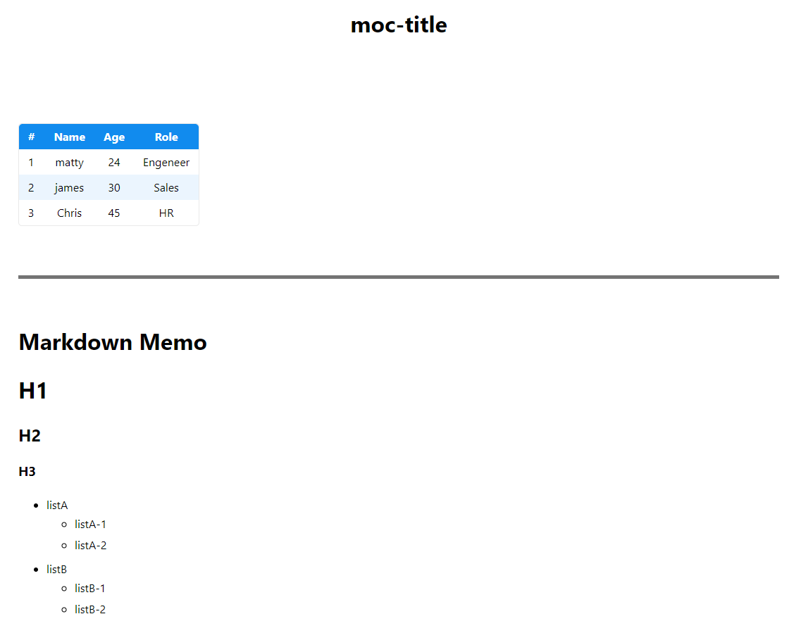

新しい画面を作りたい場合、口頭で説明したり、絵を書いたりというのも一つの手ですが、画面イメージを相手に明確に持ってもらうためには、動くモックを作るのが一番です。

そんなモックを作る技術も発展し、近年ではコードを書かずしてモックアップを作成できるようなツールは多くありますが、機能として痒いところに手が届かなかったり、学習コストが高かったりします。  
モックアップの一番の目的は「素早く作り上げること」なのにも関わらず、ツールに翻弄されているようでは元も子もありません。

そこで今回はWeb画面のモックアップをHTML×CSS×JavaScriptで書け、なおかつそのまま人の説明に転用できるフォーマットをご紹介したいと思います。

こちらでソースコードも公開しているので、是非見てみてください。

<iframe 
  class="hatenablogcard" 
  style="width:100%;height:155px;max-width:680px;"
  src="https://hatenablog-parts.com/embed?url=https://github.com/10inoino/mvpcss-moc" 
  width="300" height="150" frameborder="0" scrolling="no">
</iframe>

# 想定パターン

- 画面配置やボタンを押したときの挙動を見せるようなモックアップを作りたい。
- サーバーサイドの挙動は考えない。
- モックアップを作成する上で、考えたことなども相手に伝えられたらうれしい。
- デザインパターンなどは気にせず、自分で選定したものを使ってよい。

# 使うもの

- html
- css
- mvp.css
- marked.js
- javascript(jQuery使ってもよし)

# ディレクトリ構成

```
.
├── base.css
├── base.js
├── hoge_dir
│   ├── hoge.html
│   └── memo.md
└── fuga
    ├── fuga.html
    └── memo.md
```

モックとなるHTMLファイルと同じ階層に対してmemo.mdというマークダウンファイルを置きます。

このマークダウンファイルに画面の注意点や、モックを見せて説明する時の内容などを書き込んでおくとよいでしょう。

# mvp.cssってなんや

今回使うCSSフレームワークはmvp.cssです。

Bootstrapなども悩みましたが、BootstrapはGridsystemや特有のクラスなど、少し学習コストが発生すると判断したため、今回はノークラスCSSフレームワークで、とても軽量なmvp.cssを選定しました。

<iframe 
  class="hatenablogcard" 
  style="width:100%;height:155px;max-width:680px;"
  src="https://hatenablog-parts.com/embed?url=https://andybrewer.github.io/mvp/" 
  width="300" height="150" frameborder="0" scrolling="no">
</iframe>

こちらは規則に倣ってhtmlを記述できれば、いい感じのデザインにしてくれます。

# marked.jsってなんや

こちらを使うとマークダウンをHTMLに変換してくれます。

今回、注意書きやメモはマークダウンファイルに切り出し、それをHTML上で閲覧したい為、こちらを採用しております。


# HTMLフォーマット

実際のHTMLフォーマットはこちらです。

```html
<!DOCTYPE html>
<html>
  <head>
    <title>moc-title</title>
    <link rel="stylesheet" href="https://unpkg.com/mvp.css">
    <link rel="stylesheet" href="../base.css">

    <!--marked.js読み込み-->  
    <script src="http://cdnjs.cloudflare.com/ajax/libs/marked/0.3.2/marked.min.js"></script>
    <script src="../base.js"></script>
    <script src="memo.md"></script>
    <script>

        // mdファイルを読み込んで表示
        (function () {
            window.onload = function(){
                markdownMemo.innerHTML = marked(doc);
            };
        }());

        // その他必要なJSの処理を記載

    </script>

    <style>
        /* ページごとで必要なCSSを記載 */
    </style>
  </head>
  <body>
      <header>
        <h1>moc-h1</h1>
      </header>
      <main>
        <!-- 必要なHTMLを記載 -->

        <hr>
        <h1>Markdown Memo</h1>
        <div id="markdownMemo"></div>
      </main>
  </body>
</html>
```

上記のフォーマットの中に必要なHTML,CSS,JSを記載していきます。

また、JSで画面描画時にmarked.jsにより読み込んだMarkdownをHTMLに変換して出力しています。

これにより、このモックを人に見せる時などには、画面から他のページに移ることなく、メモ書きなどを見せることができます。

# base.css

```css
.d-none {
    display: none;
}

hr {
    height: 5px;
    background-color:#747474;
    border: none;
}
```
bootstrapを踏襲し、要素を隠すdisplay: noneはクラスを付与すれば自動的に付与されるようにしておきます。

hrは画面部とマークダウンのメモ部の境界線です。

よく使うようであればmargin,padding用のクラスなどもここに書いておくとよいと思います。

# base.js

```jsx
// mdファイルを読み込んで表示
window.onload = function(){
    markdownMemo.innerHTML = marked(doc);
};

/**
 * 指定したIDの要素にクラス追加
 * @param {string} className 
 * @param {string} targetId 
 */
function addClassToId(className, targetId) {
    document.getElementById(targetId).classList.add(className);
}

/**
 * 指定したIDの要素からクラス削除
 * @param {string} className 
 * @param {string} targetId 
 */
function removeClassFromId(className, targetId) {
    document.getElementById(targetId).classList.remove(className);
}

/**
 * 指定したIDの要素に属性追加
 * @param {string} attribute 
 * @param {string} targetId 
 */
function addAttributeToId(attribute, targetId) {
    document.getElementById(targetId).setAttribute(attribute, true);
}

/**
 * 指定したIDの要素から属性削除
 * @param {string} attribute 
 * @param {string} targetId 
 */
function removeAttributeFromId(attribute, targetId) {
    document.getElementById(targetId).removeAttribute(attribute);
}

/**
 * 指定したクラスの要素にクラス追加
 * @param {string} className 
 * @param {string} targetClass 
 */
function addClassToClass(className, targetClass) {
    Array.prototype.forEach.call(document.getElementsByClassName(targetClass), function(element) {
        element.classList.add(className);
    })
}

/**
 * 指定したクラスの要素からクラス削除
 * @param {string} className 
 * @param {string} targetClass 
 */
function removeClassFromClass(className, targetClass) {
    Array.prototype.forEach.call(document.getElementsByClassName(targetClass), function(element) {
        element.classList.remove(className);
    })
}

/**
 * 指定したクラスの要素に属性追加
 * @param {string} attribute 
 * @param {string} targetClass 
 */
function addAttributeToClass(attribute, targetClass) {
    Array.prototype.forEach.call(document.getElementsByClassName(targetClass), function(element) {
        element.setAttribute(attribute, true);
    })
}

/**
 * 指定したクラスの要素から属性削除
 * @param {string} attribute 
 * @param {string} targetClass 
 */
function removeAttributeFromClass(attribute, targetClass) {
    Array.prototype.forEach.call(document.getElementsByClassName(targetClass), function(element) {
        element.removeAttribute(attribute);
    })
}

/**
 * 指定したIDの要素を非表示
 * @param {string} targetId 
 */
function hideId(targetId) {
    addClassToId('d-none', targetId);
}

/**
 * 指定したIDの要素を表示
 * @param {string} targetId 
 */
function showId(targetId) {
    removeClassFromId('d-none', targetId);
}

/**
 * 指定したIDの要素を非活性化
 * @param {string} targetId 
 */
function disableId(targetId) {
    addAttributeToId('disabled', targetId);
}

/**
 * 指定したIDの要素を活性化
 * @param {string} targetId 
 */
function enableId(targetId) {
    removeAttributeFromId('disabled', targetId);
}

/**
 * 指定したクラスの要素を非表示
 * @param {string} targetClass
 */
function hideClass(targetClass) {
    addClassToClass('d-none', targetClass);
}

/**
 * 指定したクラスの要素を表示
 * @param {string} targetClass
 */
function showClass(targetClass) {
    removeClassFromClass('d-none', targetClass);
}

/**
 * 指定したクラスの要素を非活性化
 * @param {string} targetClass
 */
function disableClass(targetClass) {
    addAttributeToClass('disabled', targetClass);
}

/**
 * 指定したクラスの要素を活性化
 * @param {string} targetClass
 */
function enableClass(targetClass) {
    removeAttributeFromClass('disabled', targetClass);
}
```

IDとクラスに対して、要素の表示/非表示、活性/非活性はすぐに使えるように関数を用意しておきます。

# memo.md

```markdown
const doc = `
ここにmarkdownを書く
`;
```

markdownファイルは上記のように記載します。

html側では、markdownファイルをJSファイルとして読み込んでいるようなので、docという変数をで変換しています。

# 画面イメージ

画面イメージはこんな感じです。



テーブルしか無い簡単な画面ですが、勿論ボタンやプルダウン、それに連動する動きも実装可能です。

また、そのまま下に説明があるため、画面の注意点や工夫点なども、画面を見ながらそのまま話すことができます。

是非、画面モックを作成する場合には参考にしていただけたら幸いです。

# 参考資料

<iframe 
  class="hatenablogcard" 
  style="width:100%;height:155px;max-width:680px;"
  src="https://hatenablog-parts.com/embed?url=https://qiita.com/standard-software/items/154e4cb5f7e0cd198c82" 
  width="300" height="150" frameborder="0" scrolling="no">
</iframe>