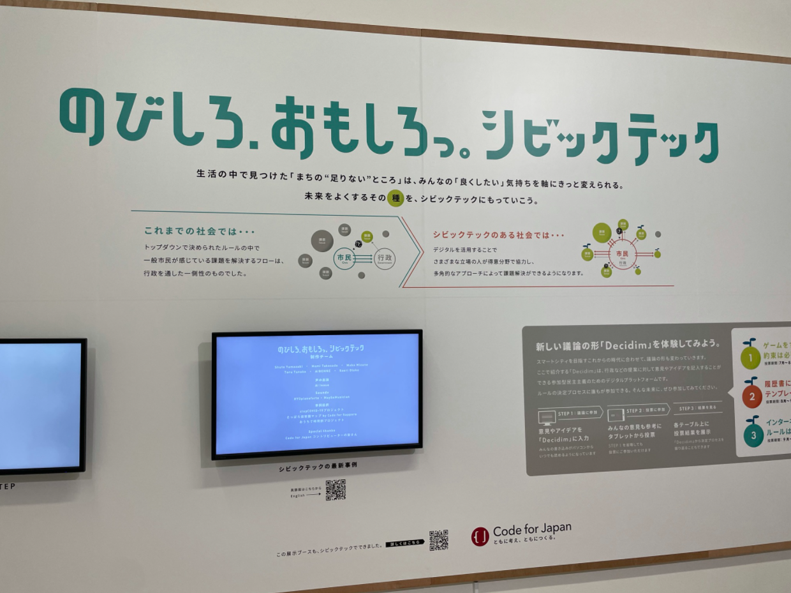

# 記事

- [2021年のエンジニア新人研修の講義資料を公開しました](https://blog.cybozu.io/entry/2021/07/20/100000)
  - サイボウズは以前から社内勉強会などの資料をよく社外に公開してくれていましたが、ついに本気を出した感がすごいなぁ。量がすごい。内容サラッと見てみるとライセンスのこととかもやってて、新人エンジニアの教育にかける思いがわかるような資料ですね～～
- [Ubisoftが基本プレイ無料FPS『エックスディファイアント』を発表。『CoD』元開発者も携わる『Tom Clancy’s』勢力大集合シューター](https://automaton-media.com/articles/newsjp/20210720-169500/)
  - よいですねぇ。見た感じだとバトロワじゃなくて、デスマッチとかドッグタグとかなのかな？結構期待できそう。
- [人気コメント算出アルゴリズムの一部にYahoo! JAPANの「建設的コメント順位付けモデルAPI」を導入しました](https://bookmark.hatenastaff.com/entry/yahoo_comment_api)
  - 分かる。成熟していないSNSプラットフォームだと、どうしてもSEOの精度が低くて、炎上したもん勝ちみたいな現象が起こるんすよね。これからのプラットフォームのモデルになればよいなぁ。
  - 参考資料：[Yahoo!ニュースにおける建設的コメント順位付けモデルの導入](https://www.anlp.jp/proceedings/annual_meeting/2019/pdf_dir/P7-33.pdf)
- [ファンレスで無音になったはずのM1搭載MacBook Airでもファンの心地よい音を再現できるアプリ「FanFan」](https://gigazine.net/news/20210719-fanfan-apple-silicon/)
  - プリウスが静かすぎて、車に乗っている感じがしないから音を出してほしいという要望があったそうだが、PCにもあんのね、そーゆーの

# ルール？展に行ってきたよ
3日前の話になりますが、ルール？展に行ってきました。

<iframe 
  class="hatenablogcard" 
  style="width:100%;height:155px;max-width:680px;"
  src="https://hatenablog-parts.com/embed?url=http://www.2121designsight.jp/program/rule/" 
  width="300" height="150" frameborder="0" scrolling="no">
</iframe>

目的はCode for Japanが作ったオープンソースTシャツの限定カラーを買うため。

展示はそのついでぐらいのつもりだったんですが、ちゃっかり楽しんできちゃいました。

詳細な感想とかは他の記事で書ければいいなぁと思ってるんですが、厳選して1つだけ感想を書きますと、  
実は今回CivicTech関連のコーナーがあったんですよね。

写真は誰も写ってないですが、周囲は結構賑わっておりました。  
ちょっと思い返すと、私がCode for Japanを知ったのは東京都コロナ対策サイトの一件で、当時はすごくTech色が強かったですが、こうして一般に溶け込んでいってるCivicTechを見ると何故か微笑ましくて、とても行ってよかったなぁと思っております。